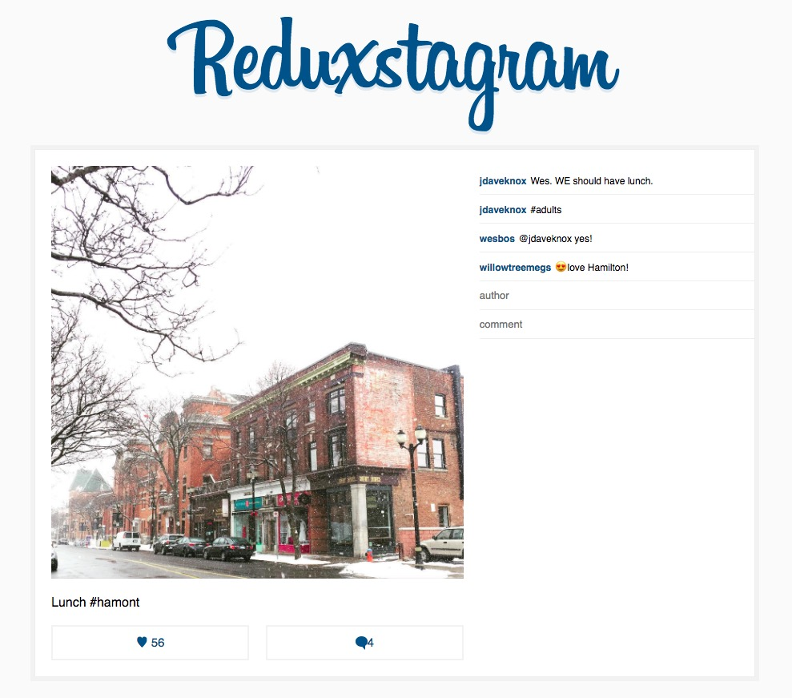

# Learn Redux

## A simple React + Redux implementation following a Wes Bos tutorial. 

Practice with Redux following Wes Bos https://learnredux.com/
* Using webpack, React Router, CSSTransitionGroup
* Instagram-style comment/view set-up to gain familiarity with components/actions/reducers updating state.
